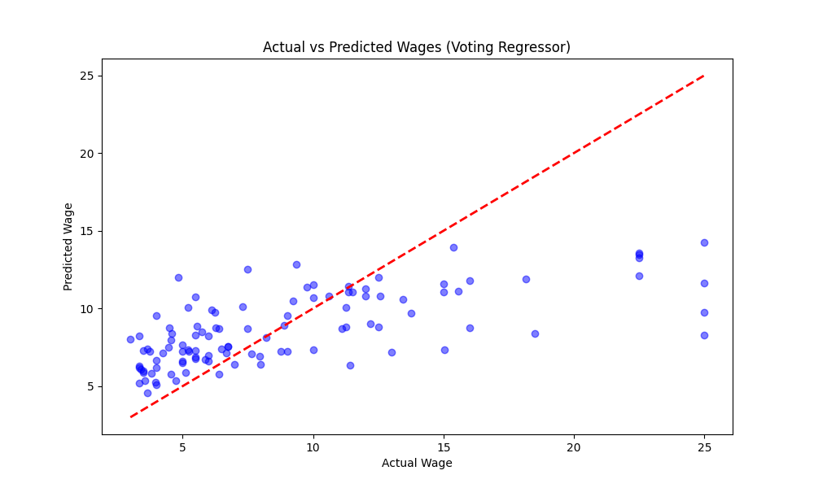
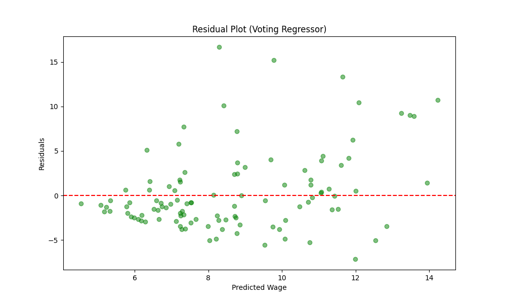
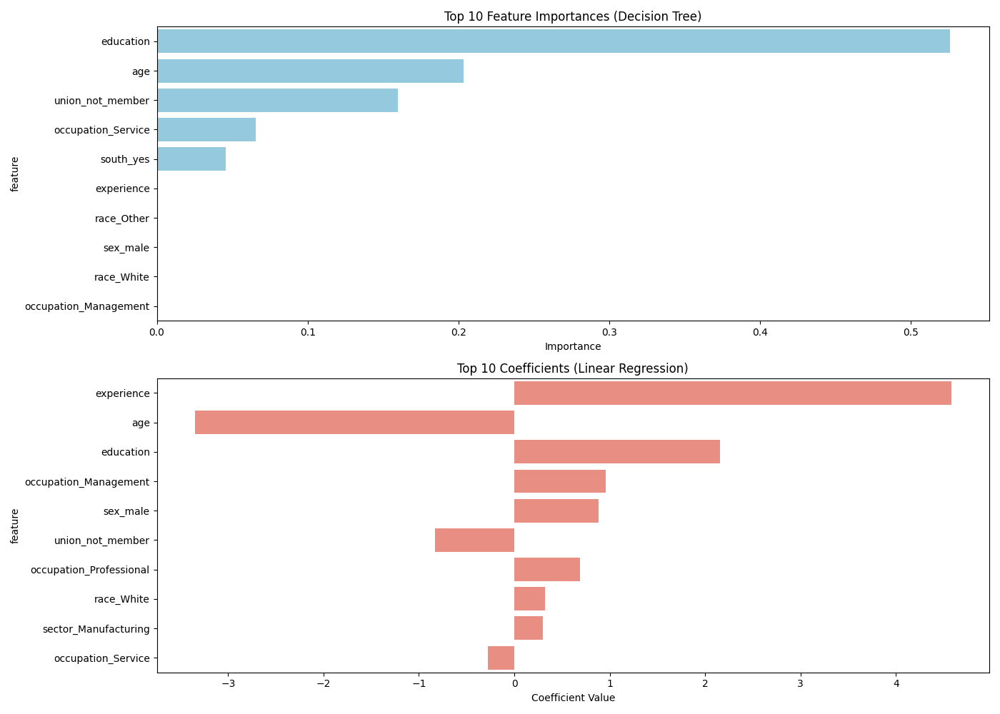
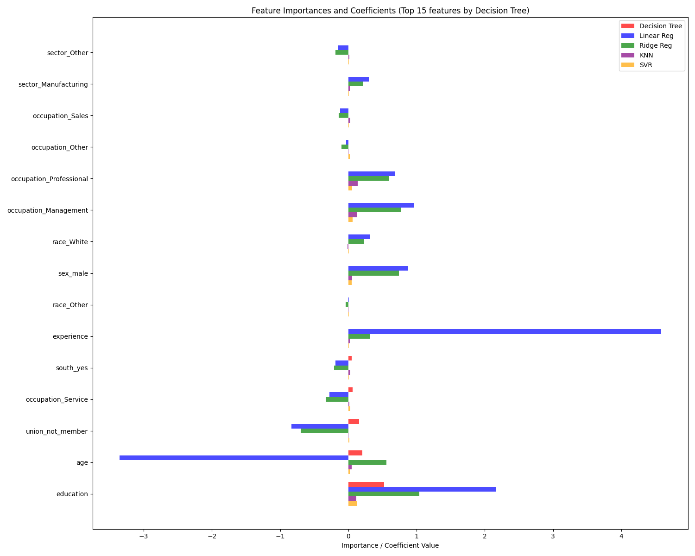

# Module 20 Analysis: Ensemble Methods for Regression

## Overview
In this activity, we explored using ensemble methods, specifically the `VotingRegressor`, to predict wages based on census data. We compared the performance of individual models (Linear Regression, KNN, Decision Tree, Ridge, SVR) against a `VotingRegressor` that combines them.

## Hyperparameter Tuning

We tuned the hyperparameters for each individual model using `GridSearchCV`. The best parameters found were:

| Model | Best Hyperparameters |
| :--- | :--- |
| **Linear Regression** | Default |
| **KNN** | `n_neighbors`: 9 |
| **Decision Tree** | `max_depth`: 3 |
| **Ridge** | `alpha`: 100.0 |
| **SVR** | `C`: 1.0, `gamma`: 'scale' |

### Voting Regressor Tuning
We also tuned the `weights` of the `VotingRegressor` to give more importance to stronger models. We tested several weight combinations and found that biasing towards the linear models (Linear, Ridge, SVR) yielded the best ensemble performance.

**Best Weights:** `[2, 1, 1, 2, 2]` (Linear: 2, KNN: 1, Tree: 1, Ridge: 2, SVR: 2)

## Performance Comparison

We evaluated the models using Mean Squared Error (MSE) and $R^2$ Score.

| Model | MSE (Lower is Better) | $R^2$ (Higher is Better) |
| :--- | :--- | :--- |
| **Linear Regression** | **19.5026** | **0.3882** |
| **Ridge** | 20.3429 | 0.3619 |
| **Voting Regressor** | 20.0974 | 0.3696 |
| **SVR** | 21.7096 | 0.3190 |
| **KNN** | 22.0915 | 0.3070 |
| **Decision Tree** | 22.4698 | 0.2951 |

### Findings
Surprisingly, the **Linear Regression model outperformed the Voting Regressor** in this specific setting. The ensemble model (MSE ~20.10) performed better than the weaker individual models (KNN, Tree) and was comparable to Ridge, but could not beat the simple Linear Regression (MSE ~19.50).

This suggests that for this particular dataset and feature set, the complexity added by the non-linear models (KNN, Tree, SVR) in the ensemble might not be capturing additional signal that isn't already captured by the linear relationship, or that the simpler linear model generalized better to the test set.

## Feature Importance

To understand what drives wage predictions, we analyzed the feature importances from the Decision Tree and the coefficients from the Linear Regression model.

### Top Features (Decision Tree)
1.  `education`
2.  `age`
3.  `union_not_member`
4.  `occupation_Service`
5.  `south_yes`

### Top Coefficients (Linear Regression)
1.  `experience` (High positive impact)
2.  `education` (High positive impact)
3.  `occupation_Management` (Positive impact)
4.  `sex_male` (Positive impact)
5.  `occupation_Professional` (Positive impact)

**Interpretation:**
Both models agree that **Education** is a critical factor. The Linear model also highlights **Experience** and certain **Occupations** (Management, Professional) as strong positive drivers of wages. The Decision Tree also identifies **Union Membership** and **Age** as important split points for determining wage groups.

## Plots

### 1. Actual vs Predicted
This plot compares the predicted wages from the Voting Regressor against the actual wages.

### 2. Residuals
This plot shows the residuals (Actual - Predicted) vs the Predicted values. A random scatter indicates a good fit, while patterns suggest missed information.

### 3. Feature Importance
Comparison of the top features from the Decision Tree and the top coefficients from the Linear Regression model.

### 4. Combined Model Feature Importance
This plot consolidates feature importance and coefficients from all models (Decision Tree, Linear, Ridge, KNN, SVR) for the top 15 features identified by the Decision Tree. It highlights how different models prioritize different features.

